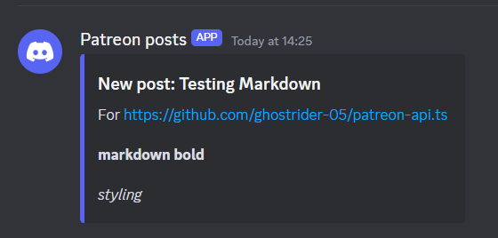
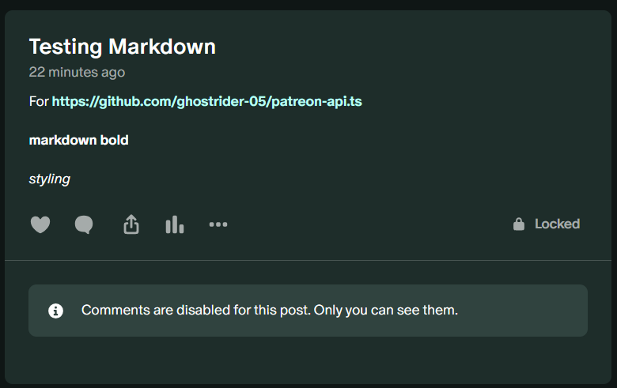

# Patreon posts to Discord

This is an example project for how to connect `patreon-api.ts` with Cloudflare Workers to send Discord messages on a new post.

Screenshots

Discord message:

Patreon post:

## Getting started

1. Clone / copy `/examples/cloudflare-webhook/` locally
2. Install dependencies: `npm install`
3. Get the webhook secret from Patreon by [registering a new webhook](#webhook-registration) using the Patreon API.
4. Update [the secrets](#secrets) on Cloudlfare to use your webhook
5. Deploy the worker with `npm run deploy` to your Cloudflare account
6. Create a post on Patreon and view the Discord message!

### Webhook registration

1. Create a new file `secrets.json` in `./src/` and define `CLIENT_ID`, `CLIENT_SECRET`, `CAMPAIGN_ID`, `WEBHOOK_URI`, `ACCESS_TOKEN`, `REFRESH_TOKEN`.
2. Run `src/generate.ts` (may need to run with `ts-node` or `tsc`)
3. Copy the secret

### Secrets

Update the following secrets using `wrangler`:

- `DISCORD_WEBHOOK_URL`: the url of the Discord webhook. You can click the `Copy url` button in the Discord client to get the url
- `PATREON_WEBHOOK_SECRET`: the webhook secret of your Patreon clients webhook.
- `HTML_MD_KEY`: the key to use for [the HTML to Markdown API](https://html-to-markdown.com/api). If you use a different converter you do not have to specify this secret
